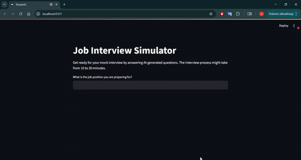

# Job Interview Simulator

This Streamlit application simulates a job interview using OpenAI's GPT models. Users can practice answering AI-generated interview questions for any job position.

## Realistic Interview Experience: Speech Recording & Transcription

A key feature of this app is the ability to record your spoken answers and convert them to text using advanced speech-to-text technology. This closely mimics the real interview process, allowing you to practice responding verbally just as you would in a live interview. By capturing your natural speech, the simulator provides a more authentic and immersive experience, helping you build confidence and improve your communication skills. The automatic transcription ensures your responses are accurately analyzed, enabling the AI to deliver relevant follow-up questions and constructive feedback.

## How to Run


1. Install dependencies:
    ```bash
    pip install -r requirements.txt
    ```

2. Set your OpenAI API key in `.streamlit/secrets.toml`:
    ```
    OPENAI_API_KEY = "your-api-key"
    ```

3. Start the app locally:
    ```bash
    streamlit run app.py
    ```
## How to use
1. Run the app as above.
2. Enter the job position you are preparing for.
3. Optionally provide a job description.
4. Record your answers using your microphone just like you would answer on interview.
5. Receive follow-up questions from the AI-interviewer
6. At the end receive feedback about your performance.
## Example video:



## File Structure

- [`app.py`]: Main Streamlit application.
- [`system_prompts.py`]: Contains different types of system prompt templates for the interview simulation.

## Notes

- The app uses OpenAI's GPT-3.5-turbo for chat and Whisper for audio transcription.
- All user and assistant messages are stored in the session state for context.
- You can customize the interview style by editing the system prompts in [`system_prompts.py`]

## License

This project is for educational purposes.